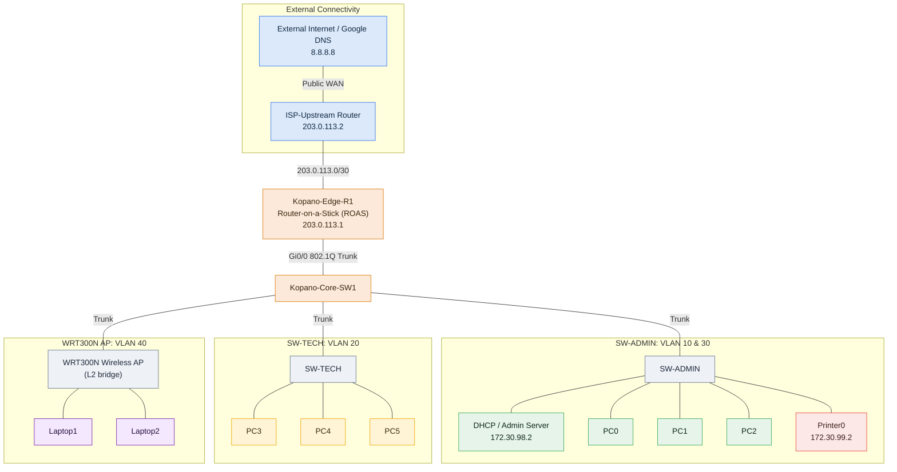

# Kopano Fibre & Wireless ISP Network Infrastructure


This is my CMPG 325 individual project for **Kopano Fibre & Wireless ISP** (Mahikeng) a segmented office network I designed and built in Cisco Packet Tracer. The repository holds the live topology (`.pkt`), the device configuration built into it, the security policies, and a test/evidence matrix with screenshots showing it works.

## Reviewer's Guide — Where to Find Everything

The four items requested for the implementation review, with direct links:

| Review Item | Where it is |
| --- | --- |
| **1. Working Packet Tracer file** | [`packet-tracer/Kopano_Network_Topology.pkt`](packet-tracer/Kopano_Network_Topology.pkt) — open in **Cisco Packet Tracer v8+** (`File → Open`) |
| **2. Assigned feature** — scoped multi-VLAN DHCP with relay (Brief §9) | Config: [§3A Router-on-a-Stick & Scoped DHCP Relays](#a-router-on-a-stick--scoped-dhcp-relays) · Design & relay rationale: [`addressing/ip-addressing-plan.md`](addressing/ip-addressing-plan.md) §4 |
| **3. Testing evidence** | Test matrix: [§5 Test Evidence & Verification Matrix](#5-test-evidence--verification-matrix) · Screenshots: [`assets/evidence/`](assets/evidence/) (tests) & [`assets/faults/`](assets/faults/) (fault cycle) · Fault log: [`docs/troubleshooting-log.md`](docs/troubleshooting-log.md) |
| **4. Updated GitHub portfolio** | This repository — full folder map in [Repository Structure](#repository-structure) below |

**Fastest review path (~5 minutes):** open the `.pkt` → confirm the DHCP relay config in §3A → run through the tests in §5 → check the fault cycle in `docs/troubleshooting-log.md`.

## Repository Structure

```
CMPG325-Kopano-Network/
├── README.md
├── packet-tracer/           Live Cisco Packet Tracer topology (.pkt)
├── assets/                  Verification evidence screenshots (TEST-01..TEST-06)
├── requirements/            Client requirements traceability matrix
├── topology/                Physical & logical topology design
├── addressing/              VLSM addressing and DHCP scope plan
└── docs/                    Milestone 1 design review
```

---

## 1. Executive Summary

I split the Kopano network into four segments administrative, technical, printing, and guest/contractor wireless so departments stay isolated from each other while still sharing the services they need. The core of what I built: strict access control between departments, one central DHCP/DNS service, NAT (PAT) out to the internet, and hardened device management (SSHv2, encrypted secrets, and a legal login banner).

### Key Architectural Highlights

* **Router-on-a-Stick (ROAS):** I routed between the VLANs with 802.1Q sub-interfaces on `Kopano-Edge-R1`, so one physical trunk carries all four networks.
* **Centralized Scoped DHCP Relay:** One dedicated DHCP server (`172.30.98.2`) hands out per-subnet pools, and I relayed every VLAN to it with `ip helper-address`.
* **Granular Access Security:** I used extended ACL 102 to block the risky file-sharing protocols (FTP/SMB) between departments while still letting them share the printer and reach the internet.
* **Perimeter NAT Overload:** The private `172.30.98.0/23` space is PAT'd out the WAN interface `203.0.113.1`, so all internal hosts share one public address.
* **Device Hardening:** I hardened both devices the same way hostnames, 1024-bit RSA keys, SSHv2-only access, idle timeouts, encrypted passwords, and a legal MOTD banner.

---

## 2. Network Topology & Addressing Schema

Everything sits on the block I was assigned, **`172.30.98.0/23`**, subnetted so each VLAN only gets the address space it actually needs the full VLSM breakdown is in `addressing/ip-addressing-plan.md`.



*Figure 1 Logical topology: public WAN → ROAS edge routing → core trunking → per-VLAN access segments.*

### IP Addressing Table

| Subnet / VLAN | VLAN ID | Subnet CIDR | IP Range | Default Gateway | Key Devices / Static Assignments |
| --- | --- | --- | --- | --- | --- |
| **Admin** | 10 | `172.30.98.0/25` | `172.30.98.1 - .126` | `172.30.98.1` | `172.30.98.2` (Central Admin/DHCP Server), PC0, PC1, PC2 |
| **Technical** | 20 | `172.30.98.128/25` | `172.30.98.129 - .254` | `172.30.98.129` | PC3, PC4, PC5 |
| **Printers** | 30 | `172.30.99.0/28` | `172.30.99.1 - .14` | `172.30.99.1` | `172.30.99.2` (Printer0) |
| **Contractor Wi-Fi** | 40 | `172.30.99.16/28` | `172.30.99.17 - .30` | `172.30.99.17` | WRT300N AP (Bridged), Laptop1, Laptop2 |
| **ISP WAN Link** | N/A | `203.0.113.0/30` | `203.0.113.1 - .2` | `203.0.113.2` | `203.0.113.1` (Kopano-Edge-R1), `203.0.113.2` (ISP Upstream) |

---

## 3. Core Technical Implementation & Configurations

### A. Router-on-a-Stick & Scoped DHCP Relays

`Kopano-Edge-R1` routes between the VLANs on 802.1Q sub-interfaces. I put `ip helper-address 172.30.98.2` on every sub-interface so each VLAN's DHCP broadcast gets forwarded as a unicast to the central server.

```text
interface GigabitEthernet0/0.10
 encapsulation dot1Q 10
 ip address 172.30.98.1 255.255.255.128
 ip helper-address 172.30.98.2
 ip nat inside
 ip access-group 102 in

interface GigabitEthernet0/0.20
 encapsulation dot1Q 20
 ip address 172.30.98.129 255.255.255.128
 ip helper-address 172.30.98.2
 ip nat inside
 ip access-group 102 in

interface GigabitEthernet0/0.30
 encapsulation dot1Q 30
 ip address 172.30.99.1 255.255.255.240
 ip helper-address 172.30.98.2
 ip nat inside

interface GigabitEthernet0/0.40
 encapsulation dot1Q 40
 ip address 172.30.99.17 255.255.255.240
 ip helper-address 172.30.98.2
 ip nat inside
 ip access-group 100 in

```

### B. Access Control Lists (ACL Security Policies)

* **ACL 100 (Contractor Isolation):** Applied inbound on `Gi0/0.40`. Contractors on the wireless VLAN can't reach the Admin server (`172.30.98.2`), but they can still get out to the internet.
* **ACL 102 (Layer 4 Inter-Departmental Isolation):** Applied inbound on `Gi0/0.10` and `Gi0/0.20`. I blocked only FTP (TCP 21) and SMB (TCP 445) between Admin and Technical the file-sharing protocols so printer access, ICMP, and internet traffic still flow.

```text
access-list 100 deny ip 172.30.99.16 0.0.0.15 host 172.30.98.2
access-list 100 permit ip any any

access-list 102 deny tcp 172.30.98.0 0.0.0.127 172.30.98.128 0.0.0.127 eq ftp
access-list 102 deny tcp 172.30.98.0 0.0.0.127 172.30.98.128 0.0.0.127 eq 445
access-list 102 deny tcp 172.30.98.128 0.0.0.127 172.30.98.0 0.0.0.127 eq ftp
access-list 102 deny tcp 172.30.98.128 0.0.0.127 172.30.98.0 0.0.0.127 eq 445
access-list 102 permit ip any any

```

> **Design Scope Note (🟠):** *I scoped the isolation to file-sharing protocols specifically FTP (TCP 21) and SMB (TCP 445). That was deliberate: printer sharing (Brief §8) and normal ICMP/management traffic still need to cross departments, so a blanket block would have broken the shared-printer requirement.*

### C. Infrastructure Hardening & Management Security

I hardened `Kopano-Edge-R1` and `Kopano-Core-SW1` the same way:

* **Hostnames & Domain:** Standard identifiers under `kopano.co.za`.
* **SSH v2 Enforcement:** I generated 1024-bit RSA keys and locked the VTY lines down to encrypted SSH only (`transport input ssh`).
* **AAA & Local Credentials:** A local `admin` account with hashed secrets.
* **CLI Protections:** `no ip domain-lookup`, `service password-encryption`, 5-minute idle timeouts (`exec-timeout 5 0`), and a legal MOTD login banner.

```text
hostname Kopano-Edge-R1
ip domain-name kopano.co.za
crypto key generate rsa general-keys modulus 1024
ip ssh version 2

username admin secret Kopano@2026!
enable secret KopanoAdminPass

service password-encryption
no ip domain-lookup

banner motd #
====================================================================
 UNAUTHORIZED ACCESS TO KOPANO FIBRE & WIRELESS ISP IS PROHIBITED.
 ALL CLI SESSIONS ARE LOGGED AND MONITORED.
====================================================================
#

line console 0
 password ConsolePass2026!
 login
 exec-timeout 5 0
 logging synchronous

line vty 0 4
 login local
 transport input ssh
 exec-timeout 5 0
 logging synchronous

```

---

## 4. Official Troubleshooting Log & Verification

> **Full troubleshooting cycle:** I ran three deliberate fault scenarios Layer 3 DHCP relay (FLT-01), Layer 2 trunk pruning (FLT-02), and ACL over-blocking (FLT-03) each with inject → capture → remediate → recover steps. The full write-up is in [`docs/troubleshooting-log.md`](docs/troubleshooting-log.md); FLT-01 below is the primary deliberate fault.

### Primary Deliberate Fault: DHCP Relay Interruption

* **Induced Fault:** I removed `ip helper-address 172.30.98.2` from `GigabitEthernet0/0.20` on `Kopano-Edge-R1`.
* **Observed Failure:** PC3, PC4, and PC5 then failed to get leases on `ipconfig /renew` and fell back to APIPA (`169.254.x.x/16`) that cut off all inter-VLAN and internet connectivity for the Technical department.
* **Root Cause Analysis:** With the helper-address gone, VLAN 20's DHCP `DISCOVER` broadcast was dropped at the sub-interface boundary the server never saw it.
* **Remediation & Resolution:** I re-applied `ip helper-address 172.30.98.2` to `Gi0/0.20` and ran `ipconfig /renew` again. PC3 picked up `172.30.98.130/25` and gateway/DNS connectivity came back.

### Supplementary Build Troubleshooting: WRT300N Wireless AP Bridging

* **Symptom:** The contractor laptops couldn't reach anything outside the network.
* **Resolution:** I reconfigured the WRT300N as a plain Layer 2 access point moved the uplink from the WAN port to a LAN port, disabled its internal DHCP, and let `Kopano-Core-SW1` handle the 802.1Q tagging on VLAN 40.

---

## 5. Test Evidence & Verification Matrix

I ran each test in Packet Tracer and captured the result (screenshots in `assets/evidence/`):

| Test ID | Test Scenario | Source Device | Target Destination | Protocol / Port | Expected Result | Actual Result / Evidence |
| --- | --- | --- | --- | --- | --- | --- |
| **TEST-01** | Scoped DHCP Allocation | PC3 (Technical) | Central DHCP Server | UDP 67/68 | **PASS** | Leased `172.30.98.130/25`, GW `172.30.98.129` ([Evidence](assets/evidence/test01_dhcp_lease.png)) |
| **TEST-02** | Internet Routing & NAT | PC0 (Admin) | `8.8.8.8` (Public DNS) | ICMP | **PASS** | 0% Packet Loss; PAT active on `203.0.113.1` ([Evidence](assets/evidence/test02_nat_ping.png)) |
| **TEST-03** | Cross-VLAN Printer Access | PC3 (Technical) | `172.30.99.2` (Printer0) | ICMP | **PASS** | 0% Packet Loss (Permitted by ACL 102) ([Evidence](assets/evidence/test03_printer_ping.png)) |
| **TEST-04** | Restricted FTP File Share | PC3 (Technical) | `172.30.98.2` (Admin Server) | TCP 21 (FTP) | **FAIL (BLOCK)** | Timed out; 24 match hits registered on ACL 102 ([Evidence](assets/evidence/test04_ftp_block.png)) |
| **TEST-05** | Guest Wi-Fi Server Block | Laptop1 (Contractor) | `172.30.98.2` (Admin Server) | IP / ICMP | **FAIL (BLOCK)** | Destination Host Unreachable via ACL 100 ([Evidence](assets/evidence/test05_guest_block.png)) |
| **TEST-06** | Encrypted SSH Management | PC1 (Admin) | `172.30.98.1` (Edge Router) | TCP 22 (SSHv2) | **PASS** | Authenticated session established to `Kopano-Edge-R1>` ([Evidence](assets/evidence/test06_ssh_verify.png)) |

---

## 6. Deployment & Running Instructions

To inspect and test this topology in Cisco Packet Tracer:

1. Clone this repository:

```bash
git clone https://github.com/Naxisbeast/CMPG325-Kopano-Network.git
```

2. Open **Cisco Packet Tracer** (v8.0 or newer).
3. Navigate to `File -> Open` and select **`packet-tracer/Kopano_Network_Topology.pkt`**.
4. **Administrative Credentials:**
   * **Console Password:** `ConsolePass2026!`
   * **Privileged EXEC (`enable`):** `KopanoAdminPass`
   * **SSH Username / Secret:** `admin` / `Kopano@2026!`

---

## 7. Beyond-the-Brief Engineering Decisions

These are the six decisions I made that I think take this past a basic submission. I've flagged each one 🟠 in the documentation, and they're worth talking through in the video.

1. **Dedicated DHCP server host** instead of putting DHCP on the router, I stood up a dedicated server (`172.30.98.2`) in VLAN 10. That forces the router to act as a real relay agent for VLANs 20/30/40, which is exactly what the brief's DHCP challenge asks for.
2. **Dedicated shared printer VLAN** I gave the printer its own VLAN 30 (`172.30.99.0/28`) instead of dropping it into a department's subnet, so printer sharing crosses departments with clean ACLs and a clear physical/logical separation.
3. **Granular Layer 4 protocol filtering** ACL 102 blocks only the file-sharing ports (FTP/SMB); I deliberately left ICMP, management, and printer traffic flowing between departments.
4. **WRT300N as a pure Layer 2 bridge** I bypassed the WRT300N's WAN port, moved the uplink to a LAN port, and disabled its DHCP so the core switch handles the 802.1Q tagging turning a consumer router into a plain L2 bridge instead of double-NATing.
5. **Outbound NAT/PAT** I PAT the private block out `203.0.113.1` (ISP `.2`, DNS `8.8.8.8`) so every internal host and contractor gets realistic internet routing.
6. **Extended star / hierarchical topology** I built it around a core switch (`Kopano-Core-SW1`) feeding two access switches over 802.1Q trunks, separating broadcast domains across wiring closets instead of one flat switch.
