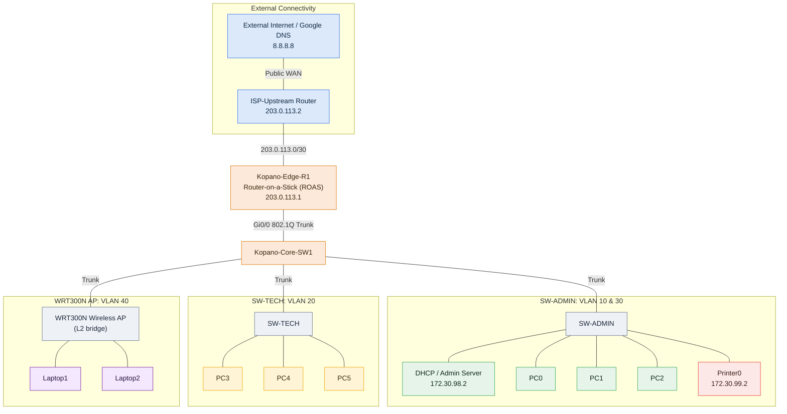

# Kopano Fibre & Wireless ISP Network Infrastructure


An enterprise-grade campus network architecture designed and implemented for **Kopano Fibre & Wireless ISP** (Mahikeng Operations). Built within Cisco Packet Tracer as part of the CMPG 325 curriculum, this repository contains the live network topology (`.pkt`), the full device configuration embedded in that build, the security policy set, and a verified test/evidence matrix with supporting screenshots.

## Repository Structure

```
CMPG325-Kopano-Network/
├── README.md
├── packet-tracer/           Live Cisco Packet Tracer topology (.pkt)
├── assets/                  Verification evidence screenshots (TEST-01..TEST-06)
├── requirements/            Client requirements traceability matrix
├── topology/                Physical & logical topology design
├── addressing/              VLSM addressing and DHCP scope plan
└── docs/                    Milestone 1 design review
```

---

## 1. Executive Summary

The Kopano ISP network provides segmented, highly secure, and resilient connectivity across administrative, technical, printing, and guest/contractor wireless operational units. The design enforces strict departmental isolation, centralized network services (DHCP, DNS), dynamic Network Address Translation (NAT Overload), and enterprise-level management security (SSH v2, encrypted AAA authentication, and legal banners).

### Key Architectural Highlights

* **Router-on-a-Stick (ROAS):** IEEE 802.1Q sub-interface routing on `Kopano-Edge-R1` driving inter-VLAN communications.
* **Centralized Scoped DHCP Relay:** Multi-subnet IP pool assignment managed by a dedicated Admin DHCP Server (`172.30.98.2`) using `ip helper-address`.
* **Granular Access Security:** Extended ACL 102 filtering Layer 4 file-sharing protocols (FTP/SMB) between departments while maintaining shared printer access and Internet routing.
* **Perimeter NAT Overload:** Dynamic Port Address Translation (PAT) mapping internal private subnets (`172.30.98.0/23`) to public WAN interfaces (`203.0.113.1`).
* **Device Hardening:** Standardized hostnames, 1024-bit RSA key generation, SSH v2 enforcement, line timeouts, password encryption, and MOTD authorization banners.

---

## 2. Network Topology & Addressing Schema

The network operates on a base block of **`172.30.98.0/23`**, custom-subnetted to satisfy variable host densities and security boundaries.



*Figure 1 — Logical topology: public WAN → ROAS edge routing → core trunking → per-VLAN access segments.*

### IP Addressing Table

| Subnet / VLAN | VLAN ID | Subnet CIDR | IP Range | Default Gateway | Key Devices / Static Assignments |
| --- | --- | --- | --- | --- | --- |
| **Admin** | 10 | `172.30.98.0/25` | `172.30.98.1 - .126` | `172.30.98.1` | `172.30.98.2` (Central Admin/DHCP Server), PC0, PC1, PC2 |
| **Technical** | 20 | `172.30.98.128/25` | `172.30.98.129 - .254` | `172.30.98.129` | PC3, PC4, PC5 |
| **Printers** | 30 | `172.30.99.0/28` | `172.30.99.1 - .14` | `172.30.99.1` | `172.30.99.2` (Printer0) |
| **Contractor Wi-Fi** | 40 | `172.30.99.16/28` | `172.30.99.17 - .30` | `172.30.99.17` | WRT300N AP (Bridged), Laptop1, Laptop2 |
| **ISP WAN Link** | N/A | `203.0.113.0/30` | `203.0.113.1 - .2` | `203.0.113.2` | `203.0.113.1` (Edge R1), `203.0.113.2` (ISP Upstream) |

---

## 3. Core Technical Implementation & Configurations

### A. Router-on-a-Stick & Scoped DHCP Relays

`Kopano-Edge-R1` uses 802.1Q sub-interfaces to route between VLANs. Each sub-interface is configured with `ip helper-address 172.30.98.2` to forward DHCP broadcast requests to the central DHCP server.

```text
interface GigabitEthernet0/0.10
 encapsulation dot1Q 10
 ip address 172.30.98.1 255.255.255.128
 ip helper-address 172.30.98.2
 ip nat inside
 ip access-group 102 in

interface GigabitEthernet0/0.20
 encapsulation dot1Q 20
 ip address 172.30.98.129 255.255.255.128
 ip helper-address 172.30.98.2
 ip nat inside
 ip access-group 102 in

interface GigabitEthernet0/0.30
 encapsulation dot1Q 30
 ip address 172.30.99.1 255.255.255.240
 ip helper-address 172.30.98.2
 ip nat inside

interface GigabitEthernet0/0.40
 encapsulation dot1Q 40
 ip address 172.30.99.17 255.255.255.240
 ip helper-address 172.30.98.2
 ip nat inside
 ip access-group 100 in

```

### B. Access Control Lists (ACL Security Policies)

* **ACL 100 (Contractor Isolation):** Applied inbound on `Gi0/0.40`. Blocks guest wireless users on VLAN 40 from reaching the sensitive Admin Server (`172.30.98.2`) while permitting outbound Internet routing.
* **ACL 102 (Layer 4 Inter-Departmental Isolation):** Applied inbound on `Gi0/0.10` and `Gi0/0.20`. Explicitly blocks FTP (TCP 21) and SMB (TCP 445) between Admin and Technical subnets to prevent unauthorized file transfers, while permitting cross-departmental printer access (`172.30.99.2`) and public Internet routing (`8.8.8.8`).

```text
access-list 100 deny ip 172.30.99.16 0.0.0.15 host 172.30.98.2
access-list 100 permit ip any any

access-list 102 deny tcp 172.30.98.0 0.0.0.127 172.30.98.128 0.0.0.127 eq ftp
access-list 102 deny tcp 172.30.98.0 0.0.0.127 172.30.98.128 0.0.0.127 eq 445
access-list 102 deny tcp 172.30.98.128 0.0.0.127 172.30.98.0 0.0.0.127 eq ftp
access-list 102 deny tcp 172.30.98.128 0.0.0.127 172.30.98.0 0.0.0.127 eq 445
access-list 102 permit ip any any

```

> **Design Scope Note (🟠):** *File-sharing isolation between Admin (VLAN 10) and Technical (VLAN 20) is enforced specifically against high-risk storage protocols (FTP on TCP 21 and SMB on TCP 445). Standard management and ICMP traffic remain permitted across departments.*

### C. Infrastructure Hardening & Management Security

Both `Kopano-Edge-R1` and `Kopano-Core-SW1` are hardened according to Cisco enterprise guidelines:

* **Hostnames & Domain:** Standardized identifiers under `kopano.co.za`.
* **SSH v2 Enforcement:** Generated 1024-bit RSA keys and restricted remote access to encrypted VTY lines (`transport input ssh`).
* **AAA & Local Credentials:** Configured local `admin` account with secret hashing.
* **CLI Protections:** Disabled DNS lookup timeouts (`no ip domain-lookup`), enforced password encryption (`service password-encryption`), set 5-minute idle timeouts (`exec-timeout 5 0`), and added legal MOTD login warnings.

```text
hostname Kopano-Edge-R1
ip domain-name kopano.co.za
crypto key generate rsa general-keys modulus 1024
ip ssh version 2

username admin secret Kopano@2026!
enable secret KopanoAdminPass

service password-encryption
no ip domain-lookup

banner motd #
====================================================================
 UNAUTHORIZED ACCESS TO KOPANO FIBRE & WIRELESS ISP IS PROHIBITED.
 ALL CLI SESSIONS ARE LOGGED AND MONITORED.
====================================================================
#

line console 0
 password ConsolePass2026!
 login
 exec-timeout 5 0
 logging synchronous

line vty 0 4
 login local
 transport input ssh
 exec-timeout 5 0
 logging synchronous

```

---

## 4. Official Troubleshooting Log & Verification

### Primary Deliberate Fault: DHCP Relay Interruption

* **Induced Fault:** Removed `ip helper-address 172.30.98.2` from `GigabitEthernet0/0.20` on `Kopano-Edge-R1`.
* **Observed Failure:** Technical PCs (PC3, PC4, PC5) failed to obtain IP leases from the central server upon running `ipconfig /renew`. The devices defaulted to Automatic Private IP Addressing (`169.254.x.x/16`), severing all inter-VLAN and Internet connectivity.
* **Root Cause Analysis:** Without the unicast `ip helper-address` encapsulation, DHCP `DISCOVER` broadcasts originated by VLAN 20 clients were dropped at the sub-interface boundary.
* **Remediation & Resolution:** Re-applied `ip helper-address 172.30.98.2` to `Gi0/0.20`. Executed `ipconfig /renew` on client endpoints, successfully restoring IP assignment (`172.30.98.130/25`), gateway reachability, and DNS resolution.

### Supplementary Build Troubleshooting: WRT300N Wireless AP Bridging

* **Symptom:** Wireless contractor laptops connected to WRT300N were unable to reach external addresses.
* **Resolution:** Reconfigured WRT300N to operate strictly as a Layer 2 access point by moving the uplink cable from the WAN port to a LAN port, disabling internal DHCP, and allowing `Kopano-Core-SW1` to handle 802.1Q tagging on VLAN 40.

---

## 5. Test Evidence & Verification Matrix

| Test ID | Test Scenario | Source Device | Target Destination | Protocol / Port | Expected Result | Actual Result / Evidence |
| --- | --- | --- | --- | --- | --- | --- |
| **TEST-01** | Scoped DHCP Allocation | PC3 (Technical) | Central DHCP Server | UDP 67/68 | **PASS** | Leased `172.30.98.130/25`, GW `172.30.98.129` ([Evidence](assets/test01_dhcp_lease.png)) |
| **TEST-02** | Internet Routing & NAT | PC0 (Admin) | `8.8.8.8` (Public DNS) | ICMP | **PASS** | 0% Packet Loss; PAT active on `203.0.113.1` ([Evidence](assets/test02_nat_ping.png)) |
| **TEST-03** | Cross-VLAN Printer Access | PC3 (Technical) | `172.30.99.2` (Printer0) | ICMP | **PASS** | 0% Packet Loss (Permitted by ACL 102) ([Evidence](assets/test03_printer_ping.png)) |
| **TEST-04** | Restricted FTP File Share | PC3 (Technical) | `172.30.98.2` (Admin Server) | TCP 21 (FTP) | **FAIL (BLOCK)** | Timed out; 24 match hits registered on ACL 102 ([Evidence](assets/test04_ftp_block.png)) |
| **TEST-05** | Guest Wi-Fi Server Block | Laptop1 (Contractor) | `172.30.98.2` (Admin Server) | IP / ICMP | **FAIL (BLOCK)** | Destination Host Unreachable via ACL 100 ([Evidence](assets/test05_guest_block.png)) |
| **TEST-06** | Encrypted SSH Management | PC1 (Admin) | `172.30.98.1` (Edge Router) | TCP 22 (SSHv2) | **PASS** | Authenticated session established to `Kopano-Edge-R1>` ([Evidence](assets/test06_ssh_verify.png)) |

---

## 6. Deployment & Running Instructions

To inspect and test this topology in Cisco Packet Tracer:

1. Clone this repository:

```bash
git clone https://github.com/Naxisbeast/CMPG325-Kopano-Network.git
```

2. Open **Cisco Packet Tracer** (v8.0 or newer).
3. Navigate to `File -> Open` and select **`packet-tracer/Kopano_Network_Topology.pkt`**.
4. **Administrative Credentials:**
   * **Console Password:** `ConsolePass2026!`
   * **Privileged EXEC (`enable`):** `KopanoAdminPass`
   * **SSH Username / Secret:** `admin` / `Kopano@2026!`
