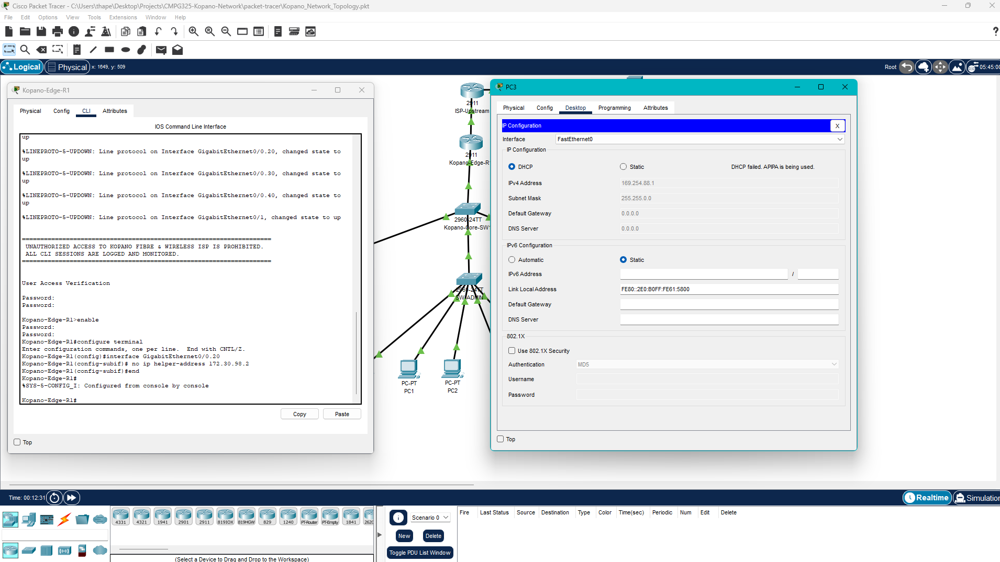
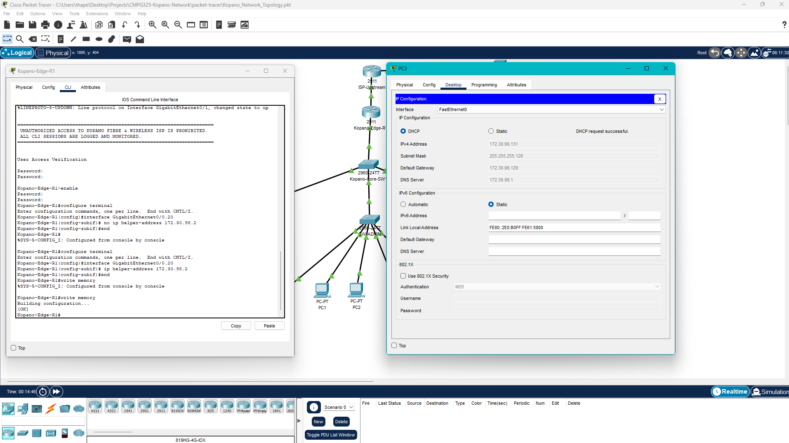
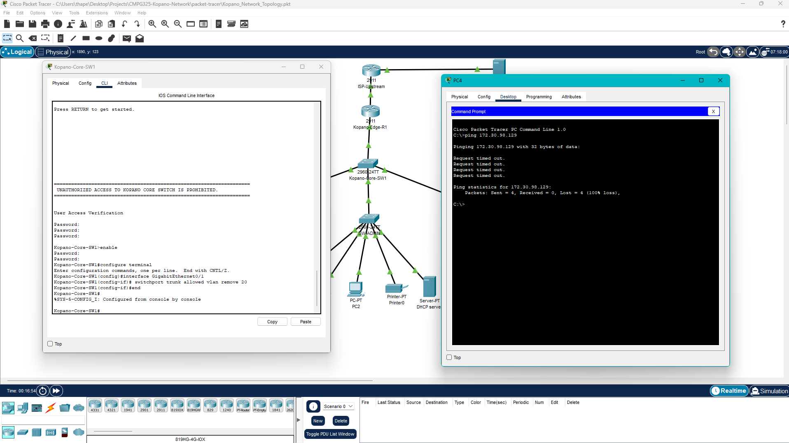
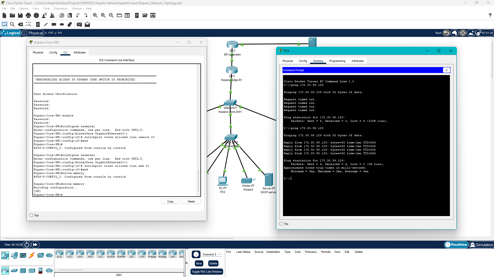
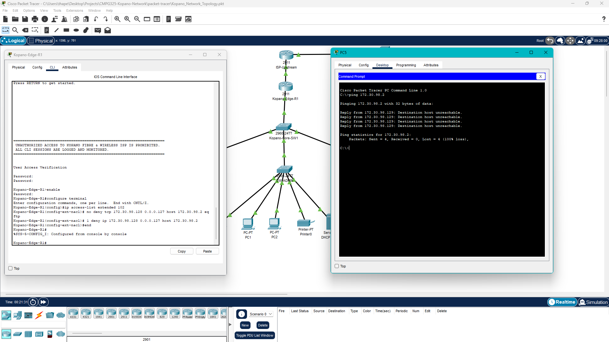
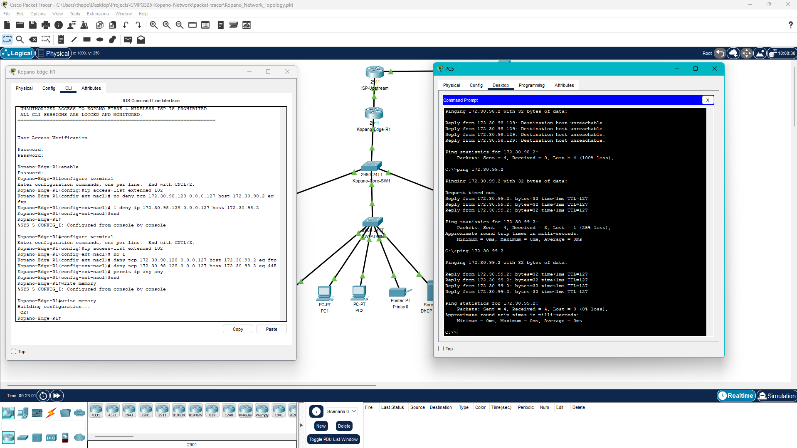

# Troubleshooting Log — Deliberate Fault Cycle

Three distinct, real-world failure scenarios demonstrate the project's troubleshooting methodology (Brief §9): a **Layer 3 DHCP relay** breakdown, a **Layer 2 trunking** failure, and a **security ACL** misconfiguration. Each follows the complete cycle — inject fault → verify & capture → remediate → verify recovery — with screenshots under [`assets/faults/`](../assets/faults/).

## Fault Summary

| Fault ID | Component | Root Cause | Symptom | Remediation Command | Verification |
| --- | --- | --- | --- | --- | --- |
| **FLT-01** | `Gi0/0.20` (`Kopano-Edge-R1`) | Missing `ip helper-address` | PC3 assigned APIPA `169.254.x.x` | `ip helper-address 172.30.98.2` | `ipconfig /renew` yields `172.30.98.130` |
| **FLT-02** | `Gi0/1` Trunk (`Kopano-Core-SW1`) | VLAN 20 removed from trunk | PC3 unable to reach gateway `172.30.98.129` | `switchport trunk allowed vlan add 20` | ICMP ping 0% loss |
| **FLT-03** | ACL 102 (`Kopano-Edge-R1`) | Blanket `deny ip` rule inserted | ICMP & printer traffic blocked from Technical | Restored L4 port-filtered rules (`eq ftp`, `eq 445`) | ICMP ping pass / FTP blocked |

---

## Scenario 1 — Layer 3 DHCP Relay Breakdown (FLT-01)

**Failure mode:** disabling DHCP relay on a sub-interface breaks cross-VLAN IP leasing.

### Step 1: Inject the Fault

On `Kopano-Edge-R1`:

```text
enable
configure terminal
interface GigabitEthernet0/0.20
 no ip helper-address 172.30.98.2
end
```

### Step 2: Verify & Capture Failure

1. On **PC3 (Technical)** Command Prompt, force a lease renewal:

```cmd
ipconfig /renew
```

2. **Result:** Request times out. PC3 drops to an APIPA self-assigned address (`169.254.x.x`).



### Step 3: Remediate (Fix)

On `Kopano-Edge-R1`:

```text
configure terminal
interface GigabitEthernet0/0.20
 ip helper-address 172.30.98.2
end
write memory
```

### Step 4: Verify Recovery

1. On **PC3** Command Prompt:

```cmd
ipconfig /renew
```

2. **Result:** PC3 re-obtains `172.30.98.130/25` from `172.30.98.2`.



---

## Scenario 2 — Layer 2 Trunking Failure (FLT-02)

**Failure mode:** removing a VLAN from an 802.1Q trunk prunes all Layer 2 frames for that broadcast domain between switches.

### Step 1: Inject the Fault

On `Kopano-Core-SW1` (uplink interface toward `SW-TECH`):

```text
enable
configure terminal
interface GigabitEthernet0/1
 switchport trunk allowed vlan remove 20
end
```

### Step 2: Verify & Capture Failure

1. On **PC3 (Technical)** Command Prompt, ping its default gateway:

```cmd
ping 172.30.98.129
```

2. **Result:** `Request timed out` (100% packet loss).



### Step 3: Remediate (Fix)

On `Kopano-Core-SW1`:

```text
configure terminal
interface GigabitEthernet0/1
 switchport trunk allowed vlan add 20
end
write memory
```

### Step 4: Verify Recovery

1. On **PC3** Command Prompt:

```cmd
ping 172.30.98.129
```

2. **Result:** 4 successful replies (0% packet loss).



---

## Scenario 3 — ACL Misconfiguration (FLT-03)

**Failure mode:** applying a blanket `deny ip` rule instead of targeted protocol ports blocks all legitimate network traffic across VLANs.

### Step 1: Inject the Fault

On `Kopano-Edge-R1`:

```text
enable
configure terminal
ip access-list extended 102
 no deny tcp 172.30.98.128 0.0.0.127 host 172.30.98.2 eq ftp
 1 deny ip 172.30.98.128 0.0.0.127 host 172.30.98.2
end
```

### Step 2: Verify & Capture Failure

1. On **PC3 (Technical)** Command Prompt, ping the Admin Server / shared printer:

```cmd
ping 172.30.98.2
```

2. **Result:** `Destination Host Unreachable` (dropped by ACL 102 on `Gi0/0.20`).



### Step 3: Remediate (Fix)

On `Kopano-Edge-R1`:

```text
configure terminal
ip access-list extended 102
 no 1
 deny tcp 172.30.98.128 0.0.0.127 host 172.30.98.2 eq ftp
 deny tcp 172.30.98.128 0.0.0.127 host 172.30.98.2 eq 445
 permit ip any any
end
write memory
```

### Step 4: Verify Recovery

1. On **PC3** Command Prompt:

```cmd
ping 172.30.99.2
```

2. **Result:** Ping succeeds while FTP (`ftp 172.30.98.2`) remains strictly blocked as per design.



---

## Notes

- FLT-01 is the primary deliberate fault summarised in [`README.md`](../README.md) §4; FLT-02 and FLT-03 extend the cycle across Layer 2 and security layers.
- All remediation steps end with `write memory` so the fix persists in the running and startup configuration.
