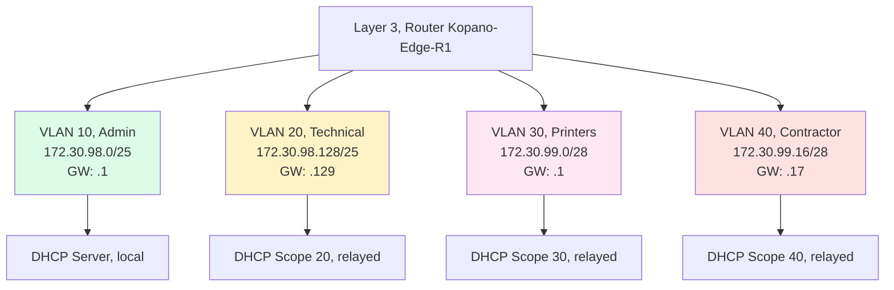
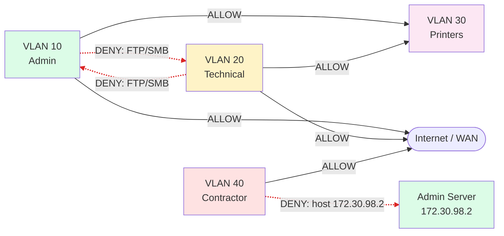
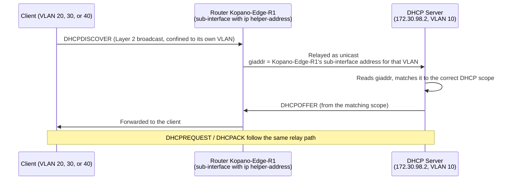

# Logical Topology
**Project:** CMPG325-2026-147, Kopano Fibre & Wireless ISP (Mahikeng)

## 1. VLAN Plan

Each VLAN is its own Layer 2 broadcast domain: a frame broadcast inside VLAN 10 never
reaches a device in VLAN 20, 30, or 40, even though they may share the same physical
switches. With four VLANs, that means four separate broadcast domains, and any traffic
that needs to move between them has to pass up to Layer 3 and be routed by Kopano-Edge-R1. This is the
concept that ties the whole design together: it's why inter-VLAN traffic needs a router in
the first place, why the ACL policy below lives at Layer 3, and why DHCP, which starts as a
Layer 2 broadcast, needs relay to cross those same boundaries.

| VLAN ID | Name | Purpose | Traceability |
|---|---|---|---|
| 10 | Admin | Administration/Business department, holds departmental file resources | 🟠 Design decision, satisfying Req #2 |
| 20 | Technical/NOC | Technical/network-operations department, holds its own departmental file resources | 🟠 Design decision, satisfying Req #2 |
| 30 | Printers | Shared printing resource, reachable by both departments | 🟠 Design decision, satisfying Req #3 |
| 40 | Contractor Wireless | After-hours cleaning/security contractor Wi-Fi (CR14) | 🟢 Brief §9, §10 |

## 2. Logical Architecture

## 3. Inter-VLAN Access Control Policy

This is the core technical demonstration required by the brief's constraint (§8) and
change request (§10). Because the router routes between VLANs at Layer 3, the access
control here has to be an extended ACL, not a standard one: a standard ACL can only match
on source address, which isn't enough to block file-sharing between Admin and Technical
while still letting printer, ICMP, and Internet traffic flow between the same subnets. An
extended ACL can match on source, destination, protocol, and port, which is what lets me
express "deny FTP/SMB between these two subnets, permit everything else" as distinct rules
on the same router interface.

*(Solid arrows are permitted; dashed red arrows are denied.)*

| Rule | Source | Destination | Action | Rationale |
|---|---|---|---|---|
| 1 | VLAN 10 (Admin) | VLAN 30 (Printers) | Permit | 🟢 Brief §8, printer sharing must cross departments |
| 2 | VLAN 20 (Technical) | VLAN 30 (Printers) | Permit | 🟢 Brief §8, printer sharing must cross departments |
| 3 | VLAN 10 (Admin) | VLAN 20 (Technical), TCP 21 (FTP) / TCP 445 (SMB) | Deny | 🟠 ACL 102 targets file-sharing protocols specifically, satisfying Brief §8's "file sharing must not cross departments" |
| 4 | VLAN 20 (Technical) | VLAN 10 (Admin), TCP 21 (FTP) / TCP 445 (SMB) | Deny | 🟠 ACL 102 targets file-sharing protocols specifically, satisfying Brief §8's "file sharing must not cross departments" |
| 5 | VLAN 10 (Admin) | VLAN 20 (Technical), all other traffic | Permit | 🟡 Explicit `permit ip any any` tail of ACL 102; ICMP, management, and Internet stay reachable across departments |
| 6 | VLAN 20 (Technical) | VLAN 10 (Admin), all other traffic | Permit | 🟡 Explicit `permit ip any any` tail of ACL 102; ICMP, management, and Internet stay reachable across departments |
| 7 | VLAN 40 (Contractor) | 172.30.98.2 (Admin server host) | Deny | 🟠 My interpretation of CR14's "limited access, preserving segmentation" (Brief §10); blocks only the sensitive server host, not the whole Admin/Technical subnets |
| 8 | VLAN 40 (Contractor) | Any other destination, incl. Internet / WAN | Permit | 🟠 Design decision, my minimum viable interpretation of "limited access" for after-hours contractor use |
| n/a | Any | Any (not matched above) | Permit (explicit tail) | Both ACLs close with `permit ip any any`, shadowing the implicit-deny default; only the deny rules above actually restrict traffic |

> **Design Scope Note (🟠):** *File-sharing isolation between Admin (VLAN 10) and Technical
> (VLAN 20) is enforced specifically against the high-risk storage protocols (FTP on TCP 21
> and SMB on TCP 445). Standard management traffic and ICMP remain permitted across
> departments.*

**Note on scope:** the brief's phrase "limited access required by the scenario" (CR14) is
deliberately broad, and the implemented ACL 100 reads it narrowly: contractors are blocked
only from the Admin server host (`172.30.98.2`), and are otherwise permitted — including
printer and Internet access — because the cleaning/security contractor has no legitimate
need to reach the central server, while walling off every departmental subnet would also
cut legitimate printing and browsing. 🟠 Design decision: this is one defensible reading
of "limited access"; if the module handbook expects contractors to be isolated from the
departmental subnets entirely, the deny in ACL 100 can be widened to the whole
`172.30.98.0/25` block without changing the policy structure. I'm flagging this so it can
be revisited.

## 4. DHCP Logical Flow

The DHCP exchange itself follows the standard DORA sequence: Discover, Offer, Request,
Acknowledge. The diagram below shows Discover and Offer explicitly; Request and Acknowledge
follow the identical relay pattern immediately afterward. I've drawn this for a client on
VLAN 20, where relay genuinely happens, since VLAN 10's DHCP traffic never leaves its own
subnet and doesn't need relay at all.

One case the diagram deliberately doesn't cover: VLAN 10. Clients there share the same
broadcast domain as the DHCP server, so their DHCPDISCOVER reaches the server directly,
with no relay involved and no giaddr populated at all. In that case the server doesn't use
giaddr to pick the scope; it matches the scope to the subnet the request physically arrived
on. The rule, stated as a contrast: in every relayed VLAN, giaddr selects the scope; in
VLAN 10, the arriving interface's subnet selects the scope instead, because there's no
relay step to populate giaddr in the first place. I'm stating this explicitly because the
rest of this document only describes the relayed case, which could read as if giaddr is the
only mechanism DHCP scope-matching ever uses. It isn't.

Without `ip helper-address` configured on Kopano-Edge-R1's VLAN 20 sub-interface, the DHCPDISCOVER
broadcast in the diagram above would never leave VLAN 20's broadcast domain, and the DHCP
server would never see it. That's precisely why relay is required to satisfy Brief §9's
demand for DHCP "across VLAN boundaries using an appropriate relay/routing arrangement,"
and it's also the fault I plan to introduce deliberately during implementation: removing
that one line produces a clean, explainable failure on VLAN 20 only, while VLAN 10 (whose
DHCP traffic never needed relay) keeps working normally.
