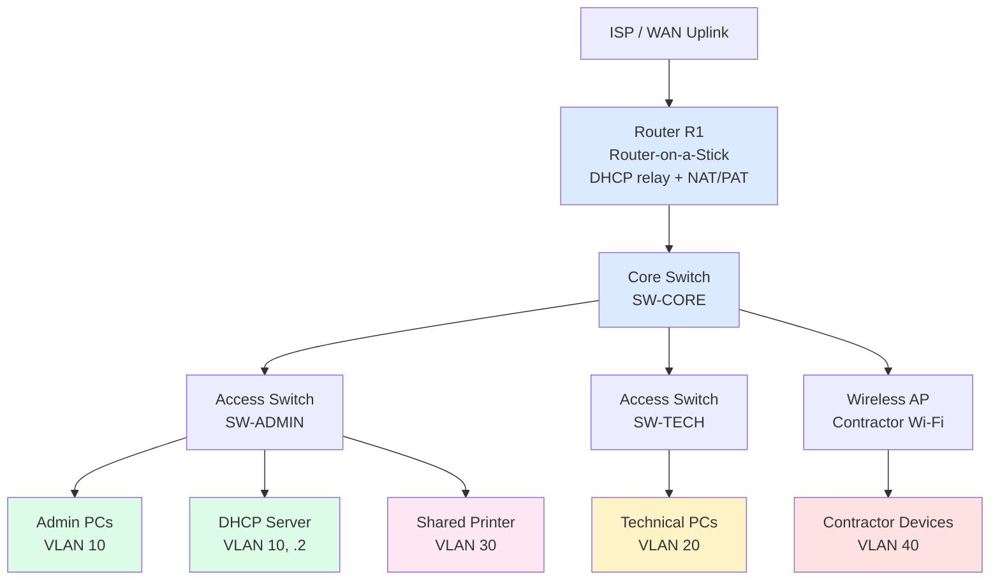

# Physical Topology
**Project:** CMPG325-2026-147, Kopano Fibre & Wireless ISP (Mahikeng)

## 1. Design Rationale

I scoped this as a small ISP office LAN, not Kopano's customer-facing fibre/wireless
infrastructure. The brief asks for the client's network environment (§2, §4), so I kept the
scope to the internal office rather than the ISP's last-mile network. I kept the device
count to the minimum that can still demonstrate every required technical challenge
(multi-VLAN, scoped and relayed DHCP, inter-VLAN ACLs, a wireless contractor segment).
Adding more devices than that would only add configuration and testing surface without
adding evidence that any requirement is actually being met. 🟠 Design decision.

## 2. Topology Classification

This design uses an extended star topology. Each switch, on its own, is already a star: a
central device with every connected node cabled directly to it, which is the standard
definition and the reason switches replaced hubs in the first place. A hub forwards every
incoming frame out every port, so every device on it shares one collision domain; a switch
gives each port its own collision domain and only forwards a frame out the port it's
actually destined for. That's why star wiring around a switch, not a bus around a shared
cable, is the sensible physical building block here.

I then take that building block and repeat it one level up: the access switches (SW-ADMIN,
SW-TECH, the AP) each form their own star around their connected end devices, and those
switches connect back to one central point, the core switch, which connects up to the
router. A star built out of stars like this is a hierarchical or tree topology, and it's
sometimes called a hybrid topology since it combines the star pattern at two levels. That
more precise term is the one I use in the diagram section below.

**Why not the other standard topologies:**

- Bus. A single shared backbone cable with all devices tapped onto it. I rejected this
  because one cable failure takes down the whole segment, there's no natural point to
  enforce VLAN or ACL boundaries, and it doesn't scale cleanly to four separate logical
  segments.
- Ring. Each device connects to exactly two neighbours, forming a loop. I rejected this
  because a single link or device failure can disrupt the whole ring, unless a second
  counter-rotating ring is added, which adds cost this project doesn't need, and it offers
  no advantage for a segmented office LAN.
- Full mesh. Every device connects directly to every other device. I rejected this because
  it needs far more cabling and ports than this office requires: with roughly 7 major
  devices, a full mesh would need 21 links for no benefit, since none of the requirements
  call for that level of redundancy.
- Star, single switch. One switch with every device on it. I rejected this on its own
  because a single switch can't cleanly host separate wiring closets per department while
  keeping the physical layout traceable to the VLAN plan, but it's the building block the
  extended star design below is made from.

**Why extended star fits this project:** it isolates a fault to one branch, so a failure on
SW-TECH doesn't take down Admin or the AP; it gives each department its own physical access
point that maps cleanly onto its VLAN; and it's the standard real-world choice for exactly
this kind of segmented office LAN.

**How it could change if requirements changed:** if Kopano's brief had asked for redundant
links, so that no single switch failure could isolate a department, I'd move toward a
partial mesh between the core and access switches, or toward two core switches with
redundant uplinks. That isn't required here, since the brief doesn't ask for fault-tolerant
physical redundancy, so I haven't added it. I'm noting it anyway to show the topology choice
was deliberate for this brief, not the only topology that could ever apply.

## 3. Link Types

Every wired link in this design (R1 to SW-CORE, SW-CORE to each access switch, access
switches to end devices and the printer) is standard Gigabit Ethernet copper, which is more
than sufficient for an office of this size and is the default Packet Tracer link type for
these device classes. 🟠 Design decision, since the brief doesn't specify link speeds; I'm
stating it here so the physical topology is fully specified rather than leaving cabling
implicit. The contractor segment is wireless by requirement (CR14), using the AP's default
802.11 configuration.

## 4. Devices

| Device | Role | Justification |
|---|---|---|
| 1x Router | Inter-VLAN routing (router-on-a-stick), DHCP relay agent, NAT/PAT for internet-bound traffic | A single router-on-a-stick is sufficient for 4 VLANs; a Layer 3 switch would add capability this project's scale doesn't require, so I kept it simple, matching the rubric's "appropriate" rather than "maximal" |
| 1x Core/Distribution Switch | Trunk aggregation from access switches and AP to the router | Central point for 802.1Q trunks |
| 2x Access Switches | Access-layer connectivity for Admin and Technical end devices, and the shared printer | One per department keeps the physical wiring-closet story simple and traceable to the VLAN plan |
| 1x Wireless Access Point | Contractor Wi-Fi (CR14) | Explicitly required: "dedicated limited-access wireless segment" (Brief §9) |
| PCs | End-user devices, Admin and Technical | Represent departmental staff |
| 1x Network Printer | Shared print device | Central to the printer-sharing requirement (Brief §8) |
| 1x DHCP Server | Hosts the DHCP service, placed in VLAN 10 (Admin) | 🟠 Design decision: I moved DHCP off the router and onto a dedicated server so that relay is genuinely required for VLANs 20, 30, and 40, which is what the brief's technical challenge actually asks me to demonstrate. See `addressing/ip-addressing-plan.md` §4 for the full reasoning. |

**On NAT/PAT:** the ACL policy permits contractor devices to reach the internet, and every
VLAN's clients will need internet access for normal operation. Since 172.30.x.x is private
address space, none of it is routable on the public internet, so the router performs NAT
(specifically PAT, Port Address Translation, overloading one public IP for all internal
hosts) on its WAN-facing interface for traffic leaving the network. This isn't part of the
assigned technical challenge, but it's necessary for the design to actually work end to end,
so I'm stating it here rather than leaving it implicit.

## 5. Physical Diagram (Extended Star)



*(ASCII version below for quick reference outside GitHub's renderer.)*

```
                              ISP / WAN Uplink
                                    |
                              [ Router R1 ]
                              (Router-on-a-Stick,
                               DHCP relay, NAT/PAT)
                                    |
                           [ Core Switch SW-CORE ]
                                    |
              ┌─────────────────────┼─────────────────────┐
              |                     |                     |
     [ Access SW-ADMIN ]   [ Access SW-TECH ]      [ Wireless AP ]
        |    |     |            |         |              |
    Admin  DHCP  Printer    Tech PCs   (nothing else)  Contractor
    PCs   Server (VLAN 30)  (VLAN 20)                   devices
  (VLAN 10)(VLAN 10)                                    (VLAN 40)
```

Both the printer and the DHCP server plug into the SW-ADMIN access switch physically, but
neither one belongs to VLAN 10 by default just because of where it's cabled: the printer's
access port is assigned to VLAN 30 and the DHCP server's access port stays in VLAN 10. This
is the concrete demonstration that physical wiring (Layer 1) and logical VLAN membership
(Layer 2) are separate decisions: a device's cable doesn't decide its broadcast domain, its
switch-port configuration does. That separation is exactly what makes "printer sharing
crosses departments, file sharing doesn't" achievable with a clean ACL instead of
per-exception rules bolted onto each department's VLAN.

## 6. Trunk / Access Port Summary

| Link | Type | VLANs Carried |
|---|---|---|
| R1 to SW-CORE | Trunk (802.1Q) | 10, 20, 30, 40 |
| SW-CORE to SW-ADMIN | Trunk | 10, 30 |
| SW-CORE to SW-TECH | Trunk | 20, 30 |
| SW-CORE to AP | Access | 40 |
| SW-ADMIN to Admin PCs | Access | 10 |
| SW-ADMIN to DHCP Server | Access | 10 |
| SW-ADMIN to Printer | Access | 30 |
| SW-TECH to Tech PCs | Access | 20 |

I made the SW-CORE-to-AP link an access port rather than a trunk, deliberately. The AP
carries exactly one VLAN (VLAN 40, confirmed in the logical topology, where it's the only
scope relayed to the AP), so trunking here would tag every frame with a VLAN ID that can
only ever take one value, which is functionally pointless. Every other trunk in this table
exists because it carries multiple VLANs: R1 to SW-CORE carries all four, SW-CORE to
SW-ADMIN carries 10 and 30, and SW-CORE to SW-TECH carries 20 and 30. That contrast is the
point: multiple VLANs on a link means a trunk; a single VLAN means an access port.
